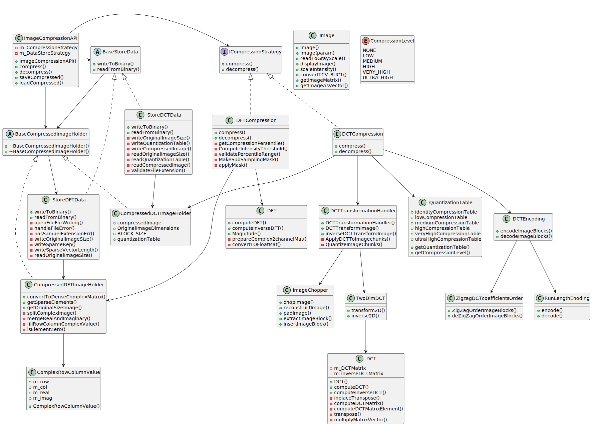

# Image-Compression

## Introduction

To make the most of my time between assignments, I took on this personal project that combined my interest in image processing with software development. I developed a lossy image compression tool from scratch in C++, inspired by the techniques used in the JPEG standard. This involved implementing the discrete cosine transform, various encoding techniques, and creating a custom binary file format, which I named ".samuel," to store the compressed data.
Beyond the nice mathematics of image compression, this project also deepened my understanding of software development as it grew in complexity. I applied design patterns and set up automated unit testing using GitHub Actions and CMake.

## Examples

Compress and Save an Image:

```cpp
ImageCompressionAPI api = ImageCompressionAPI::create(Method::DCT); // call static factory method

Image img = Image("C:/input/picture.tif");

auto compressedImage = api.compress(img, CompressionLevel::HIGH);

api.saveCompressed(*compressedImage, "camera.samuel", "C:/output/");
```

Load, decompress and view image:

```cpp
ImageCompressionAPI api = ImageCompressionAPI::create(Method::DCT); // call static factory method

auto compressedImage = api.loadCompressed("camera.samuel", "C:/output/");

Image reconImage = api.decompress(*compressedImage);

reconImage.displayImage();
```

## Software Design

### Design Patterns

- **Strategy Pattern**: The ICompressionStrategy interface is the base class for the compression strategies. This makes the strategy pattern possible and makes it easy to add a new strategy without changing much of the code.

- **Dependency Injection**: The ImageCompressionAPI class accepts compression strategies through its constructor.

- **Factory Method**: For ease of use, I added a static factory method that takes an enum representing the compression strategy. This way, the user of the API class does not need to pass an instance of the concrete strategy classes.

- **Composition**: Complex components are built by composing smaller, focused classes (e.g., DCTCompression uses DCTTransformationHandler, QuantizationTable, etc.)

### Important Classes and Responsibilities

- **ImageCompressionAPI**: The main entry point for users, providing a simple interface.
- **ICompressionStrategy**: Defines the interface that all compression algorithms must adhere to.
- **DCTCompression/DFTCompressor**: Concrete implementations of compression algorithms
- **Image**: Wrapper class around the OpenCV Matrix representation of an image, with some extra functions.

### Class Diagram:


# Compression Strategy
```

┌─────────────┐     ┌──────────────────────┐     ┌─────────┐    ┌────────────┐
│ Input Image │ --> │ Transformer/compress │ --> │ Encoder │ -->| Compressed │
└─────────────┘     └──────────────────────┘     └─────────┘    └────────────┘
      |                                                               ^
      |                                                               |                   
      └───────────────────────────────────────────────────────────────┘
                                 Decompression
```
In very simple terms, lossy compression is based on the fact that we can transform an image into a new domain. In this domain, only a few data points have significant values. This means that we can discard all other data points and still reconstruct the image to a reasonable level.

The best-known of such transforms is the Fourier Transform (FT). The FT can deconstruct a signal into a weighted sum of sine and cosine functions. The weights are called the Fourier coefficients. Other transforms with similar properties include the cosine transform (also used in this project and JPEG) as well as wavelet transforms and many others.

In the image below, an example is given of compression using the Fourier Transform. You can see that most coefficients close to the edge (high frequencies) are close to zero. So we can set them to zero and still reconstruct the image. It's easy to see how this could be used to store images efficiently.


One difference between this example and my implementation is that I don’t set an area of the image to zero, but I set the lowest values to zero. This is to retain high-frequency coefficients that are significant.

## Fourier Compression

The first approach I implemented was a naive Fourier-based compression. Here, I transformed the image to the Fourier domain (using OpenCV's DFT implementation), resulting in a two-channel array of real and imaginary numbers of the same size as the original image.

Thereafter, I calculated the magnitude of each coefficient. Next, I set a percentage of the lowest-magnitude coefficients to zero. This way, we end up with a Fourier domain image where only a small part of the significant coefficients is retained.

This is nice, but we still have an image of the same size, just with a lot of zeros. So now we need to efficiently store the information. Here, I chose a {Column, Row, Value} format. For every nonzero element, we store its location and value (a complex value in the case of the FT).

## Discrete Cosine Transform Compression

Secondly, I implemented the Discrete Cosine Transform (DCT) compression, a core component of the JPEG standard, and I implemented the DCT from scratch.

The DCT is closely related to the Discrete Fourier Transform (DFT), but it uses only cosine functions as basis functions. This results in only real coefficients which simplifies the representation. Both the DCT and DFT can compact image information; however, the DCT's exclusive use of cosine functions often results in a more concentrated information distribution in the low-frequency components for many natural images.

### Mathematics 

The **DCT**, is defined as follows, transforms an input signal $ x[n] $ of length $ N $ into frequency coefficients $ X[k] $:

$$
X[k] = \sum_{n=0}^{N-1} x[n] \cdot  \alpha(k) \cos \left( \frac{\pi (2n + 1) k}{2N} \right)
$$

The normalization factor $ \alpha(k) $ is:

$$
\alpha(k) =
\begin{cases}
\sqrt{\frac{1}{N}}, & k = 0 \\
\sqrt{\frac{2}{N}}, & k \geq 1
\end{cases}
$$

This equation tells us how to compute the frequency coefficients $ X[k] $ by taking a weighted sum of the input signal $ x[n] $, with each weight being a cosine function at the $ k^{th} $ frequency.

In the code, the DCT operation is implemented using **matrix-vector multiplication**. This means that the DCT is represented as a matrix, where each element of the matrix corresponds to a **cosine basis function**. 

The **DCT matrix** is computed as follows:

$$
\text{DCTMatrix}[i][j] = \alpha(i) \cdot \cos \left( \frac{\pi (2j + 1) i}{2N} \right)
$$

Where:
- $ \text{DCTMatrix}[i][j] $ corresponds to the **element at the $i^{th}$ row and $j^{th}$ column** in the matrix.
- $ \alpha(i) $ is the normalization factor for the $i^{th}$ row.
- $ \cos \left( \frac{\pi (2j + 1) i}{2N} \right) $ is the cosine function determining the transformation for each coefficient.

This matrix transforms the input signal from the **spatial domain** to the **frequency domain**.

In the implementation, the input signal is treated as a vector $ x $ of length $ N $, and the **DCT matrix** is multiplied by this vector to obtain the transformed frequency coefficients:

$$
X = \text{DCTMatrix} \times x
$$

Similarly, the **inverse DCT** is performed by multiplying the **inverse of the DCT matrix** (which is the transpose of the original matrix) with the frequency coefficients to recover the signal:

$$
x = (\text{DCTMatrix})^{T} \times X
$$

### DCT Compression Implementation 

The DCT compression has several more steps than the DFT approach:

1. Cut image into 8x8 blocks
2. DCT
3. Perform quantization
4. ZigZag encode the transformed image blocks
5. Run-length encoding

#### 1. Cut image into 8x8 blocks

Unlike the DFT, we perform the DCT on blocks of the image instead of the image as a whole. So the first step is to cut the image up into blocks, where the image may need to be zero-padded.

#### 2. DCT

Then we DCT each image block, where we use the fact that the DCT is separable in its dimensions so we can perform a 1D DCT on each image row and then perform another 1D DCT column-wise.

#### 3. Perform quantization

Here we also diverge from the DFT approach where we just removed the smallest coefficients. Here we divide the transformed 8x8 image block by a so-called quantization table. These tables have been empirically found to have the least amount of negative perceptible effect on the compressed image.

Below we see an example of a quantization table. As you can see, in the upper right values are low and in the bottom left values are high. This is to remove more high-frequency components and leave the lower frequencies alone.  

```cpp
const std::vector<std::vector<int>> QuantizationTable::highCompressionTable = {
    {8, 6, 6, 8, 12, 20, 25, 30},
    {6, 6, 7, 10, 13, 29, 30, 28},
    {7, 7, 8, 12, 20, 28, 34, 28},
    {7, 9, 12, 16, 26, 44, 40, 31},
    {9, 12, 20, 28, 33, 55, 52, 39},
    {12, 18, 28, 32, 41, 52, 57, 46},
    {24, 32, 39, 44, 52, 61, 60, 50},
    {36, 46, 48, 50, 56, 50, 52, 49}};
```

#### 4. ZigZag encode the transformed image blocks

Now that we have our transformed and quantized image blocks, we need to store them efficiently. To do this, we want to order the coefficients from high to low frequency. This means we traverse the image block in a zigzag pattern as shown in the snippet below:

```cpp
imageBlock = {{1,  2,  6,   7},
              {3,  5,  8,  13},
              {4,  9,  12, 14},
              {10, 11, 15, 16}};

result = {1, 2, 3, 4, 5, 6, 7, 8, 9, 10, 11, 12, 13, 14, 15, 16}
```

#### 5. Run-length encoding

Now that we have orderd the image block such that zero value coefficents are clusterd neer the end we can effcently store this using runleght encoding. where a sequance of the same value are stored as a pair ```{value,runLenght}```.


## Features

- **Custom Compression Format**: Compress images into a custom ".samuel" file format.
- **Domain Transformation**: Transform images to a new domain (e.g., Fourier domain) for efficient compression.
- **Multiple Compression Levels**: Support for various compression levels to balance quality and file size.
- **Unit Testing**: Comprehensive unit tests to ensure code reliability.
- **OO Design**: Object-oriented design principles for maintainable and scalable code.
- **Interface**: Command-line interface for easy interaction with the tool (WIP).

## Goals

- Practice C++ programming.
- Implement object-oriented design.
- Develop unit tests for code reliability.
- Create a user-friendly interface.

## Dependencies

- CMake 3.11 or higher
- OpenCV
- GoogleTest

## References

- [JPEG Compression Video](https://www.youtube.com/watch?v=0me3guauqOU)

